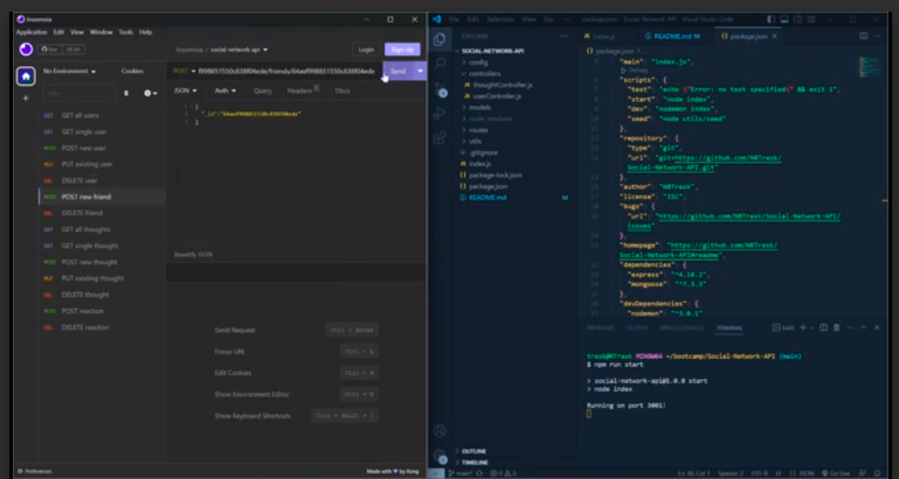

# Social-Network-API

## Description
Our challenge was to build an API for a social network web application. This application allows users to share their thoughts, react to friends' thoughts, and create a friend list. Some of the things I learned and new technologies I used are MongoDB database and virtuals, along with furthering my knowledge in using Express.js for routing.

## Usage
This applications walk through video demonstrates the GET, POST, PUT, and DELETE methods for users and thoughts, as well as the POST and DELETE methods for thought reactions and friend lists. After seeding the data, use the command "npm run start" in the integrated terminal, which is declared in the scripts of the package.json file. Since there isnt a front end you will have to use an application like Insomnia to test the API routes.

To watch a video breakdown, click [here](https://drive.google.com/file/d/1IoVcI9JJ2b1LZzPSkV_gnOXS_3ePeXJo/view)

